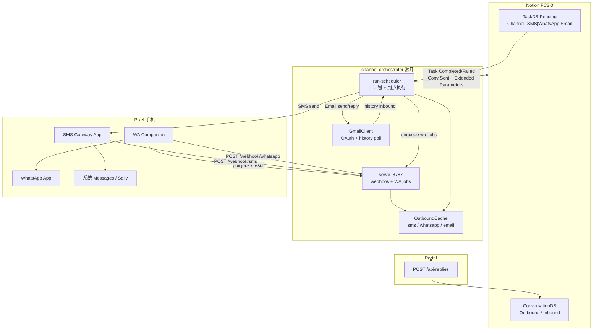
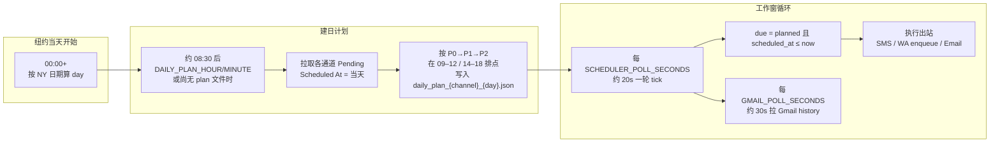
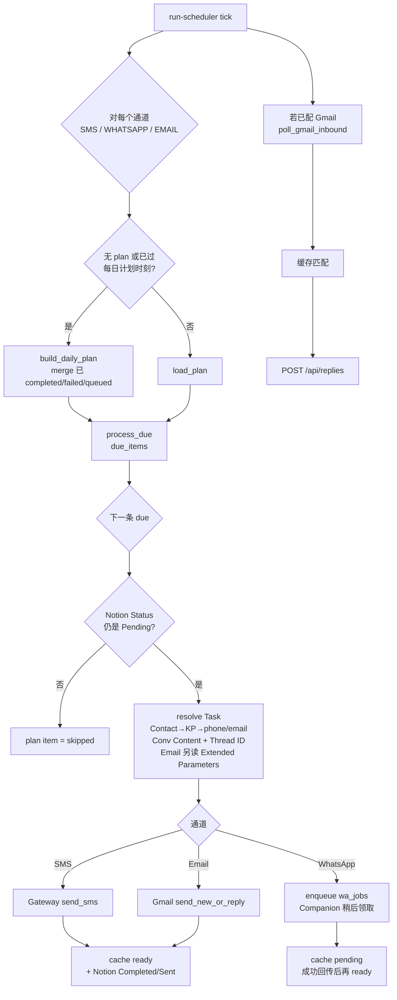
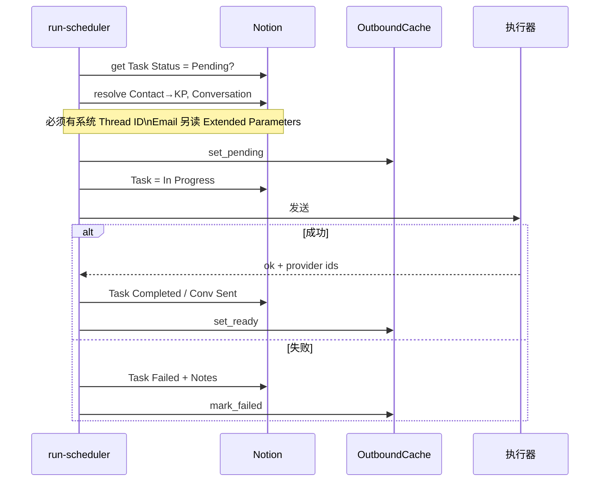
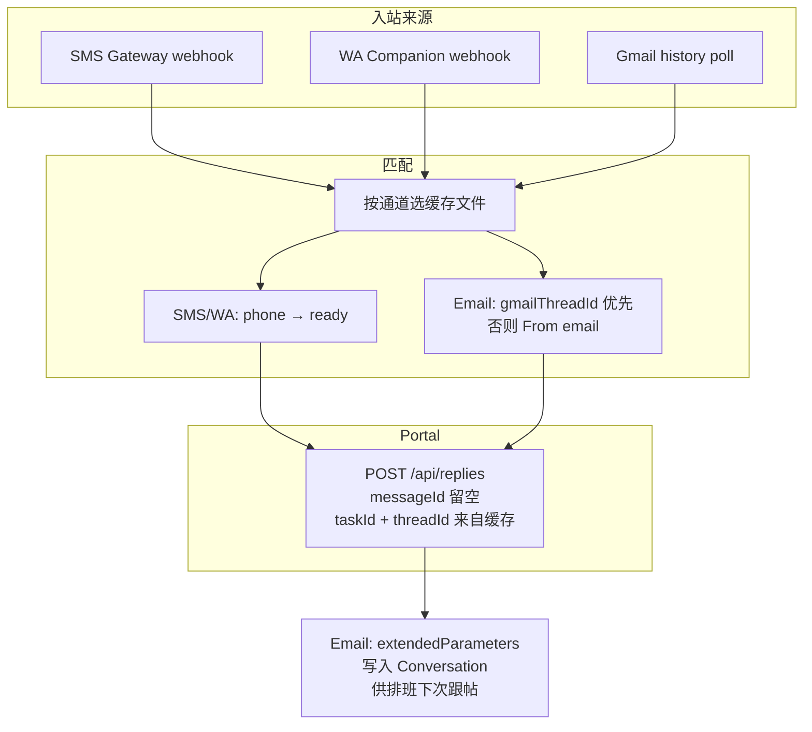

# 完整架构与每日执行流程

> 更新：2026-09-15  
> 范围：SMS + WhatsApp + Email（Gmail）  
> 代码：`channel-orchestrator/` · `wa-companion/` · 手机 SMS Gateway  
> 核对用：请对照本页图与真实部署是否一致

---

## 0. 现状说明（给你 check）

| 文档 | 有没有图 | 是否覆盖三通道 + 每日执行 |
|---|---|---|
| [PLAN.md](./PLAN.md) | ASCII，偏 SMS | 否（缺 Email、缺统一日流程） |
| [PLAN_WHATSAPP.md](./PLAN_WHATSAPP.md) | ASCII | 仅 WA |
| [API_WA_PROBE.md](./API_WA_PROBE.md) | 无 | WA 号码探测 API（不走 Task） |
| [PLAN_EMAIL.md](./PLAN_EMAIL.md) | 文字 + 前置 | 仅 Email |
| [PLAN_REPLY_INGEST.md](./PLAN_REPLY_INGEST.md) | 文字流程 | Reply 契约，非全天调度 |
| [IMPLEMENTATION.md](./IMPLEMENTATION.md) | 早期蓝图 | **过时**（n8n / AutoJs 等） |
| **本文 ARCHITECTURE.md** | Mermaid 全图 | **是：三通道架构 + 每天怎么跑** |

---

## 1. 总体架构



### 执行面分工

| 通道 | 出站执行 | 入站监听 |
|---|---|---|
| SMS | 服务器调手机 **SMS Gateway** | Gateway → `POST /webhook/sms` |
| WhatsApp | Companion 轮询 **wa_jobs** → 本机 UI | 通知/读屏 → `POST /webhook/whatsapp` |
| Email | 服务器 **Gmail API** 直发 | 服务器 **history 轮询**（不经手机） |

---

## 2. 每天如何执行（核心）

时区默认 **`America/New_York`**。常驻命令：

```bash
cd channel-orchestrator
python3 -m channel_orchestrator.cli serve --port 8787          # 终端 A：API / webhook / WA jobs
python3 -m channel_orchestrator.cli run-scheduler --channel all # 终端 B：日计划 + 到点发送 + Gmail poll
```

### 2.1 一天时间线



### 2.2 每个 tick 实际做什么



### 2.3 日计划文件（按通道分开）

| 文件 | 含义 |
|---|---|
| `data/daily_plan_sms_YYYY-MM-DD.json` | 当天 SMS 排程 |
| `data/daily_plan_whatsapp_YYYY-MM-DD.json` | 当天 WhatsApp 排程 |
| `data/daily_plan_email_YYYY-MM-DD.json` | 当天 Email 排程 |
| `data/wa_jobs.json` | WA 待发队列（Companion 消费） |
| `data/last_outbound_by_phone_{sms\|whatsapp\|email}.json` | 入站匹配缓存 |
| `data/gmail_history_state.json` | Gmail historyId 游标 |

### 2.4 工作窗与间隔（默认）

| 配置 | 默认 | 作用 |
|---|---|---|
| `TIMEZONE` | America/New_York | 「当天」与工作窗 |
| `WORK_WINDOWS` | 09:00-12:00,14:00-18:00 | 可排程时段（午休不发） |
| `MIN_SEND_INTERVAL_SECONDS` | 90 | SMS/Email 最小间隔 |
| `WA_MIN_SEND_INTERVAL_SECONDS` | 120 | WhatsApp 排程间隔 |
| `DAILY_PLAN_HOUR` / `MINUTE` | 8 / 30 | 之后会（重）建当日 plan |
| `SCHEDULER_POLL_SECONDS` | 20 | 调度轮询 |
| `GMAIL_POLL_SECONDS` | 30 | Email 入站轮询 |

---

## 3. 出站流程（按通道）

### 3.1 公共：resolve → 发送 → Notion / 缓存



### 3.2 通道差异

| 步骤 | SMS | WhatsApp | Email |
|---|---|---|---|
| 收件人 | Key Person.`Phone` | 同左 | Key Person.`Email` |
| 正文 | Conversation.`Content` | 同左 | 同左 + Subject |
| 系统 Thread ID | Conversation.`Thread ID` | 同左 | 同左 |
| 供应商线程 | — | — | `Extended Parameters.gmailThreadId` 空=新开，有=跟帖 |
| 执行器 | Gateway HTTP | Companion 领 job | Gmail API |
| ready 时机 | Gateway 返回成功后 | Companion `result ok` 后 | Gmail send 成功后 |

---

## 4. 入站与 Reply 回写



**两个 ID 不要混：**

| 名字 | 是什么 | 用在哪 |
|---|---|---|
| `threadId` | 系统线程，如 `THR-…-SMS` | Portal `/api/replies`、Conversation.`Thread ID` |
| `gmailThreadId` | Gmail 线程 | 仅 `Extended Parameters`（及 Email 缓存） |

Email 入站：优先按 `gmailThreadId` 挂原 Task；From≠出站收件人时见 [PLAN_EMAIL_PROXY_REPLY.md](./PLAN_EMAIL_PROXY_REPLY.md)（同公司 `proxyReply` / 跨域 `unexpectedSender`）。

无 Task ready 时走冷进线 `POST /api/inbound`（Domain → `FollowUpClientId`），见 [PLAN_EMAIL_COLD_INBOUND.md](./PLAN_EMAIL_COLD_INBOUND.md)。

详情：[PLAN_REPLY_INGEST.md](./PLAN_REPLY_INGEST.md) · [PLAN_EMAIL.md](./PLAN_EMAIL.md)

---

## 5. 组件与端口一览

| 组件 | 地址 / 路径 | 职责 |
|---|---|---|
| Orchestrator API | `:8787` | `/webhook/sms` `/webhook/whatsapp` `/wa/jobs/*` `/health` |
| SMS Gateway | 常 `:8080` 或 adb reverse | 本机发短信 / 推入站 |
| Portal replies | 如 `:5173/api/replies` | 入站挂到 Task/Thread |
| Gmail API | googleapis.com | 发信 + history |

---

## 6. 建议你核对的清单

- [ ] 生产是否同时常开 `serve` + `run-scheduler --channel all`
- [ ] Notion 三通道 Pending 的 `Scheduled At` 是否按纽约「当天」
- [ ] Conversation 是否都有系统 `Thread ID`（缺则 resolve 失败不发）
- [ ] Email 新开线程 Extended Parameters 为空；跟帖任务已带 `gmailThreadId`
- [ ] SMS/WA 手机侧 Gateway / Companion 总开关 ON，能访问编排公网/内网
- [ ] `.env` 中 `REPLY_WEBHOOK_*`、`GMAIL_*`、`SAILY_PHONE_E164` 正确

有出入直接改本页或对应 PLAN，避免再散落过时 ASCII 图。
