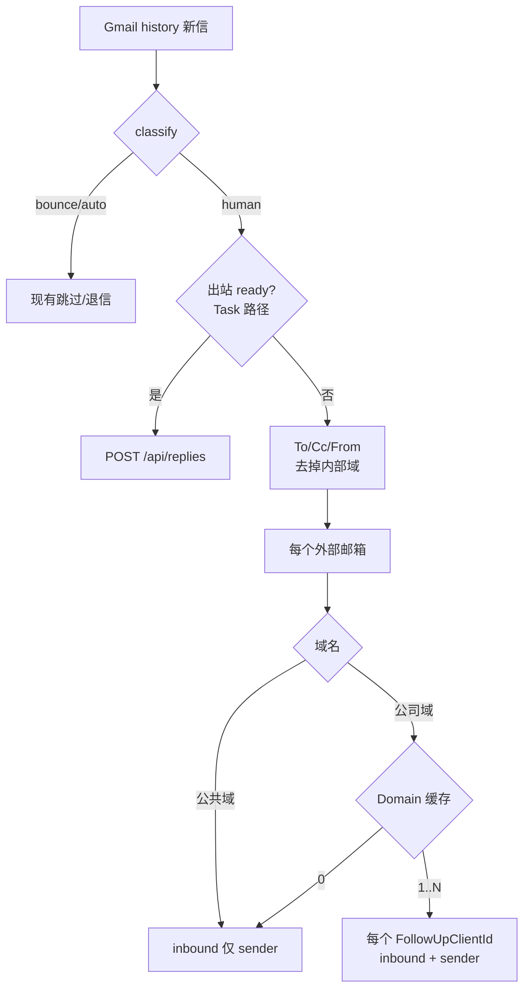

# Email 冷进线（无 Task）方案

> 更新：2026-09-18  
> 状态：**已实现**  
> Portal：`https://followup-portal.fridgechannels.com/api/inbound`（字段：`FollowUpClientId`）  
> Domain 源：[FC3.0-Follow-up-ClientDB](https://app.notion.com/p/8b04a997c66f40dd8f237234450f3c58) → 关联 ClientDB.`Domain`  
> DS：`9a07646d-190c-4346-9ab6-96c2e40d66a7`

## 已确认规则

| # | 约定 |
|---|---|
| 1 | ID = Follow-up Client 页面 ID，请求字段 **`FollowUpClientId`** |
| 2 | 个人域 / 匹配不上 Client：仍回写，**仅 `sender`** |
| 3 | 从 To/Cc/From 取全部**外部**地址，逐一尝试 Domain 匹配 |
| 4 | 命中多个 Follow-up Client → **每个都发** inbound |
| 5 | Domain 缓存扫 **全表**，含 Is Test |
| 6 | 冷路径 **完全不看** Gmail thread / 出站 thread 缓存 |

与 Task 关系：**有 Task 出站 ready → 只走 `/api/replies`，不进冷进线。**

## 接口（实现口径）

```bash
# 已知品牌
curl -sS -X POST "https://followup-portal.fridgechannels.com/api/inbound" \
  -H "Authorization: Bearer local-reply-ingest" \
  -H "Content-Type: application/json" \
  -d '{
    "channel": "Email",
    "object": "Magnet inquiry",
    "content": "We saw your Magnet offer…",
    "sender": "buyer@acme.com",
    "FollowUpClientId": "<Follow-up Client 页面 ID>"
  }'

# 仅邮箱（全局定位 Contact → Brand）
curl -sS -X POST "https://followup-portal.fridgechannels.com/api/inbound" \
  -H "Authorization: Bearer local-reply-ingest" \
  -H "Content-Type: application/json" \
  -d '{
    "channel": "Email",
    "object": "Magnet inquiry",
    "content": "We saw your Magnet offer…",
    "sender": "buyer@acme.com"
  }'
```

## 流程



## 代码落点

| 模块 | 作用 |
|---|---|
| `client_domain_cache` | 全表同步 `data/followup_client_domains.json` |
| `inbound_portal` | `POST /api/inbound`（永不带 `taskId`） |
| `email_cold_inbound` | 外部址 + Domain 命中 → 多次 inbound |
| `inbound` | Task miss 且有 body → 冷进线 |
| `gmail_client.parse_inbound_message` | 解析 To/Cc |
| CLI `sync-client-domains` | 手动同步；`run-scheduler` 按 `CLIENT_DOMAIN_SYNC_SECONDS` 定时 |

## 配置

- `INBOUND_WEBHOOK_URL`（默认 Portal 生产 inbound）
- `NOTION_FOLLOWUP_CLIENT_DS`
- `EMAIL_INTERNAL_DOMAINS`（默认 `fridgechannels.com`）
- `CLIENT_DOMAIN_SYNC_SECONDS`（默认 3600）
